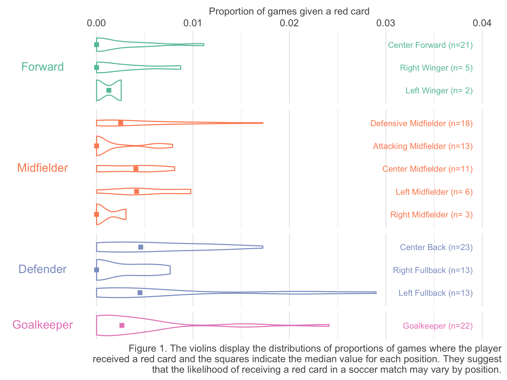

## Multiverse analysis in R

Suppose you want to taken each player's position information into account in building the model. As seen in Figure 1, defensive players were more prone to receiving a red card in a match. Controlling for a player's position thus seems like a reasonable choice.

```{r multiverse-tut-position-plot, out.width="80%"}

```

Note that the data set provides _typical position_ each player played _as of June 2014_ when Silberzahn et al. (2018) collected them. However, the red card and game counts may represent an accumulation over multiple years depending on the player's career. During these years, a player may have played multiple positions. This leads to a disconnect between the position information and the red cards on record. For example, a center back as of June 2014 may have received a red card while playing as a right full back. 

To address the issue, one may consider grouping the positions assuming that most players do not switch between the groupings over their careers. Figure 1 shows a common grouping of the positions<sup>3</sup>. We may also consider grouping all positions on the field and only keep goalkeeper as a separate position. Or, we may even decide not to use the position information at all deeming the information as unreliable. 

We can argue that all four options below provide _defensible_ analysis paths.

+   Use position variable as is
+   Group positions into the common 4 groups as shown in Figure 1
+   Group positions into fielders vs. goalkeeper
+   Do not use position information

### Multiverse analysis using `mverse`

`mverse` is a package that helps define multiverse analyses. We will demonstrate a multiverse analysis across the four defensible analysis paths, or analysis universes. 

First, we start by initiating an `mverse` object with the data set of interest. We will also use the `tidyverse` package for manipulation.

```{r mverse-tut-init, echo=TRUE, message=FALSE, eval=FALSE}
library(tidyverse)
library(mverse)
mv <- mverse(soccer)
```

### Specifying options at decision points

`mverse` specifies different options at each decision point with _branches_. For example, we use `mutate_branch()` to define the options for defining _position_. We can provide each option as an R expression as if we were creating a new column using `mutate()` in tidyverse separated by a comma.

```{r mverse-tut-branch, echo=TRUE, eval=FALSE}
new_position <- mutate_branch(
  position, # use position as is
  forcats::fct_collapse(
    # forcats::fct_collapse() is a convenient helper function for regrouping factors
    position, 
    Forward = c("Center Forward", "Right Winger", "Left Winger"), 
    Midfielder = c("Defensive Midfielder", "Attacking Midfielder", 
                   "Right Midfielder", "Center Midfielder", "Left Midfielder"), 
    Defender = c("Center Back", "Right Fullback", "Left Fullback"), 
    Goalkeeper = c("Goalkeeper")), # groups position into 4 groups
  if_else(position == "Goalkeeper", "Goalkeeper", "Fielder") # group all fielders
)
```

To specify the model equation, we use `formula_branch()`. We can provide the model equations as if you were writing the model formula in base R separated by a comma. We need to refer to the name of the branch when including a branched variable. i.e., `new_position`.

```{r mverse-tut-formula, echo=TRUE, eval=FALSE}
model <- formula_branch(
  cbind(redCards, games - redCards) ~ skintone, # do not use position information
  cbind(redCards, games - redCards) ~ skintone + new_position # include position variable
)
```

To fit the model, we need to add the defined branches to the `mverse` object with data. We will also add a `family_branch()` to specify the underlying distribution of the model. Although we are not creating a branch with multiple options `mverse` requires `family_branch()` to fit logistic regression models. We can add the branches by piping the object through `add_***_branch()` functions<sup>4</sup>.

```{r mverse-tut-add-branches, echo=TRUE, eval=FALSE}
logit_reg <- family_branch(binomial(link = "logit"))
mv <- mv %>%
  add_mutate_branch(new_position) %>%
  add_formula_branch(model) %>%
  add_family_branch(logit_reg)
```

Note that each branch in `mverse` represents a decision point and by default, all options in each branch are multiplexed throughout all options in other branches. That is, the three options for `position` variable in `mv` are applied for both options of including and excluding the variable in `formula`. To avoid the unnecessary duplicate universes, we can using `branch_condition()` to condition the option without `position` in model equation with one of the options for `position`. When conditioning options, we need to provide the R expressions used to defined the options as shown below.

```{r mverse-tut-branch-condition, echo=TRUE, eval=FALSE}
condition_position <- branch_condition(
  cbind(redCards, games - redCards) ~ skintone, # formula with no position option
  position # position as is option 
)
```

We then add the branch condition to `mv` option just as we did with branch definitions.

```{r mverse-tut-add-condition, echo=TRUE, eval=FALSE}
mv <- add_branch_condition(mv, condition_position)
```


### Fitting models across the multiverse

To allow fitting logistic regression models, `mverse` provides `glm_mverse()` which calls `glm()` across the multiverse as defined by the branches. The function executes `glm()` for each unique analysis paths specified by the branches and branch conditions.

```{r mverse-tut-glm, echo=TRUE, eval=FALSE}
multiverse_fit <- glm_mverse(mv)
```

### Results

We can use `summary()` function for the multiverse GLM object to extract the estimated coefficients and the corresponding confidence intervals. The output is a tibble that contains estimates for all coefficients across all analysis paths. We can then select the subset that contains estimates for the variable interest, `skintone`. The resulting table consists of 4 rows each representing an analysis path we defined. 

> **Technical note:** `summary()` for fitted `mverse` object calls `broom::tidy()` for each universe in the background. While you can extract the confidence intervals directly from `broom::tidy()` with `conf.int = TRUE`, it can be considerably slow for multiple `glm()` objects. Using the estiamted standard error for computing the confidence interval gives a slightly different but still reasonable results.

```{r mverse-tut-glm-summary, echo=TRUE, eval=FALSE}
summary(multiverse_fit, conf.int = FALSE) %>%
  filter(term == 'skintone')
```

```{r mverse-tut-glm-summary-disp}
load("03-multiverse-analysis.RData")
multiverse_est
```

The estimates are in log-odd scale. We can compute the estimates and the confidence intervals in odd scale by exponentiating the estimate

```{r mverse-tut-glm-exp, echo=TRUE, eval=FALSE}
summary(multiverse_fit, conf.int = FALSE) %>%
  filter(term == 'skintone') %>% 
  mutate(
    conf.low = exp(estimate + qnorm(.025) * std.error),
    conf.high = exp(estimate + qnorm(.975) * std.error),
    estimate = exp(estimate)
  ) %>%
  select(universe, estimate, conf.low, conf.high, new_position_branch, model_branch) # rearrange columns for display
```

```{r mverse-tut-glm-res}
multiverse_res
```

From the table above, we observe that the results are consistent in direction and statistical significance at 95% confidence level across the multiverse of analysis paths. The results indicate that players with very dark skin tones suffer approximately `r sprintf("%.1f%%", min(multiverse_res$estimate) * 100 - 100)`~`r sprintf("%.1f%%", max(multiverse_res$estimate) * 100 - 100)` (Odd ratio 95% CIs ranging approximately within [`r sprintf("%.2f", min(multiverse_res$conf.low))`, `r sprintf("%.2f", max(multiverse_res$conf.high))`]) higher odds of getting a red card during match compared to their colleagues with very light skin tones. 

```{=html}
<hr />
<footnote id="note3"><sup>3</sup>We referred to <a href="https://yoursoccerhome.com/soccer-positions-a-complete-and-easy-to-understand-guide/" target="_blank">this guide</a> for the groupings.</footnote>
<br /><footnote id="note4"><sup>4</sup><code>filter_branch()</code> and <code>add_filter_branch()</code> are also available that multiplexes <code>filter()</code> of tidyverse.</footnote>
```
